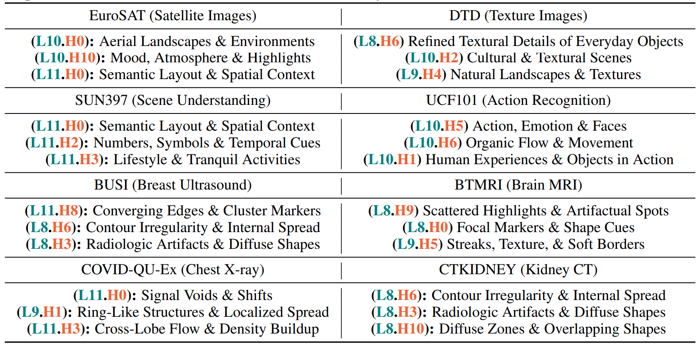
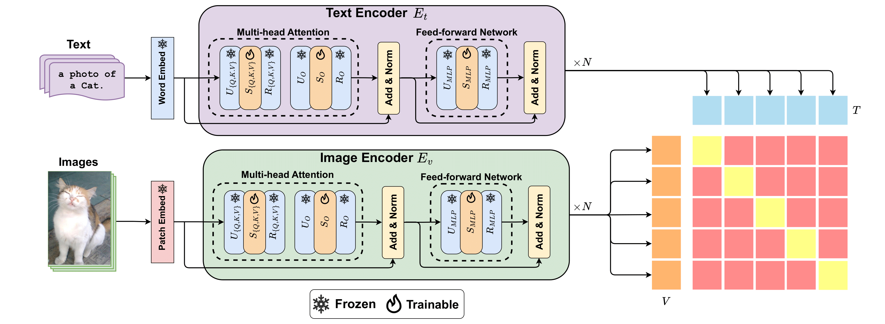

# Singular Value Few-shot Adaptation of Vision-Language Models
**[Health-X Lab](http://www.healthx-lab.ca/)** | **[IMPACT Lab](https://users.encs.concordia.ca/~impact/)** 

[Taha Koleilat](https://tahakoleilat.github.io/), [Hassan Rivaz](https://users.encs.concordia.ca/~hrivaz/), [Yiming Xiao](https://yimingxiao.weebly.com/curriculum-vitae.html)

[](https://arxiv.org/abs/2411.15232)
[](#overview)
[](https://huggingface.co/datasets/TahaKoleilat/BiomedCoOp)
[](#citation)

## Overview


> **<p align="justify"> Abstract:** *Vision-language models (VLMs) like CLIP have shown impressive zero-shot and few-shot learning capabilities across diverse applications. However, adapting these models to new fine-grained domains remains difficult due to reliance on prompt engineering and the high cost of full model fine-tuning. Existing adaptation approaches rely on augmented components, such as prompt tokens and adapter modules, which could limit adaptation quality, destabilize the model, and compromise the rich knowledge learned during pretraining. In this work, we present **CLIP-SVD**, a novel *multi-modal* and *parameter-efficient* adaptation technique that leverages Singular Value Decomposition (SVD) to modify the internal parameter space of CLIP without injecting additional modules. Specifically, we fine-tune only the singular values of the CLIP parameter matrices to rescale the basis vectors for domain adaptation while retaining the pretrained model. This design enables enhanced adaptation performance using only **0.04%** of the model's total parameters and better preservation of its generalization ability. CLIP-SVD achieves state-of-the-art classification results on 11 natural and 10 biomedical datasets, outperforming previous methods in both accuracy and generalization under few-shot settings. Additionally, we leverage a natural language-based approach to analyze the effectiveness and dynamics of the CLIP adaptation to allow interpretability of **CLIP-SVD**.* </p>

## Method

<p float="left">
  
</p>

1) **SVD-Based Few-Shot Adaptation**: We propose an SVD-based adaptation framework for Transformer-based multi-modal models (e.g., CLIP and BiomedCLIP) for the first time, requiring only **0.04%** of the model’s total parameters—significantly lower than other multi-modal methods.  
2) **Comprehensive Validation Across Domains**: We perform extensive evaluation on 11 natural and 10 biomedical datasets, showing that CLIP-SVD outperforms state-of-the-art methods in both accuracy and generalization.  
3) **Interpretable Adaptation Dynamics**: By analyzing ranked weight changes, we employ a natural language-facilitated approach to intuitively interpret the effectiveness and dynamics of task-specific CLIP adaptation.  
4) **Semantic Interpretation for Biomedical Applications**: To address the need for interpretability of attention heads in CLIP for biomedical use cases (e.g., CLIP-SVD analysis), we build the first corpus of biomedical image descriptions.  

## Results
Results reported below show accuracy for few-shot scenarios as well as base and novel classes across 11 biomedical recognition datasets averaged over 3 seeds.
### Few-shot Evaluation
| **Method**             | $K=1$ | $K=2$ | $K=4$ | $K=8$ | $K=16$ |
|-------------------------|:-------:|:-------:|:-------:|:-------:|:-------:|
| [CLIP-Adapter](https://arxiv.org/abs/2110.04544)           |  44.66  |  43.91  |  44.36  |  45.42  |  46.69  |
| [Tip-Adapter](https://arxiv.org/abs/2111.03930)            |  49.19  |  52.36  |  57.33  |  61.98  |  67.15  |
| [Tip-Adapter-F](https://arxiv.org/abs/2111.03930)          |  51.17  |  52.74  |  61.23  |  65.91  |  70.91  |
| [Standard LP](https://arxiv.org/abs/2103.00020)           |  47.25  |  54.21  |  61.00  |  65.85  |  69.40  |
| [LP++](https://arxiv.org/abs/2404.02285)                   |  47.24  |  53.18  |  59.02  |  63.69  |  68.35  |
| [CoOp](https://arxiv.org/abs/2109.01134)                  |  50.16  |  54.18  |  59.75  |  65.84  |  69.62  |
| [CoCoOp](https://arxiv.org/abs/2203.05557)                |  48.49  |  51.28  |  54.69  |  61.08  |  65.09  |
| [KgCoOp](https://arxiv.org/abs/2303.13283)                |  50.85  |  53.18  |  57.82  |  62.08  |  62.84  |
| [ProGrad](https://arxiv.org/abs/2205.14865)               |  51.88  |  54.71  |  60.42  |  65.61  |  67.13  |
| [**BiomedCoOp**](https://arxiv.org/abs/2411.15232)  | **57.03** | **59.13** | **63.95** | **68.32** | **72.42** |
### Base-to-Novel Generalization
| Name                                                      | Base Acc. | Novel Acc. |    HM     |  
|-----------------------------------------------------------|:---------:|:----------:|:---------:|  
| [BiomedCLIP](https://arxiv.org/abs/2303.00915)            |   47.84   |   65.42    |   53.81   |  
| [CoOp](https://arxiv.org/abs/2109.01134)                  |   73.85   |   64.75    |   67.23   |  
| [CoCoOp](https://arxiv.org/abs/2203.05557)                |   72.26   |   67.03    |   67.22   |  
| [KgCoOp](https://arxiv.org/abs/2303.13283)                |   68.36   |   64.08    |   64.61   |  
| [ProGrad](https://arxiv.org/abs/2205.14865)               |   71.67   |   66.93    |   67.43   |  
| [**BiomedCoOp (ours)**](https://arxiv.org/abs/2411.15232) |   **76.26**   | **73.92**  | **75.07** |  

## Model Checkpoints and Logs
| Name                                                      | Few-Shot | Base-to-Novel |  
|-----------------------------------------------------------|:---------:|:----------:| 
| [**BiomedCoOp**](https://github.com/HealthX-Lab/BiomedCoOp/blob/main/trainers/BiomedCoOp/biomedcoop_biomedclip.py) |  [link](https://huggingface.co/TahaKoleilat/BiomedCoOp/tree/main/few_shot)  | [link](https://huggingface.co/TahaKoleilat/BiomedCoOp/tree/main/base2new) |

## Installation 
For installation and other package requirements, please follow the instructions detailed in [INSTALL.md](assets/INSTALL.md). 

## Data preparation
Please follow the instructions at [DATASETS.md](assets/DATASETS.md) to prepare all datasets.

## Training and Evaluation
Please refer to the [RUN.md](assets/RUN.md) for detailed instructions on training, evaluating and reproducing the results using our pre-trained models.

<hr />

## Citation
If you use our work, please consider citing:
```bibtex
@inproceedings{koleilat2025biomedcoop,
  title={Biomedcoop: Learning to prompt for biomedical vision-language models},
  author={Koleilat, Taha and Asgariandehkordi, Hojat and Rivaz, Hassan and Xiao, Yiming},
  booktitle={Proceedings of the Computer Vision and Pattern Recognition Conference},
  pages={14766--14776},
  year={2025}
}
```

## Acknowledgements

Our code builds upon the [CoOp](https://github.com/KaiyangZhou/CoOp), [MaPLe](https://github.com/muzairkhattak/multimodal-prompt-learning), and [LP++](https://github.com/FereshteShakeri/FewShot-CLIP-Strong-Baseline) repositories. We are grateful to the authors for making their code publicly available. If you use our model or code, we kindly request that you also consider citing these foundational works.